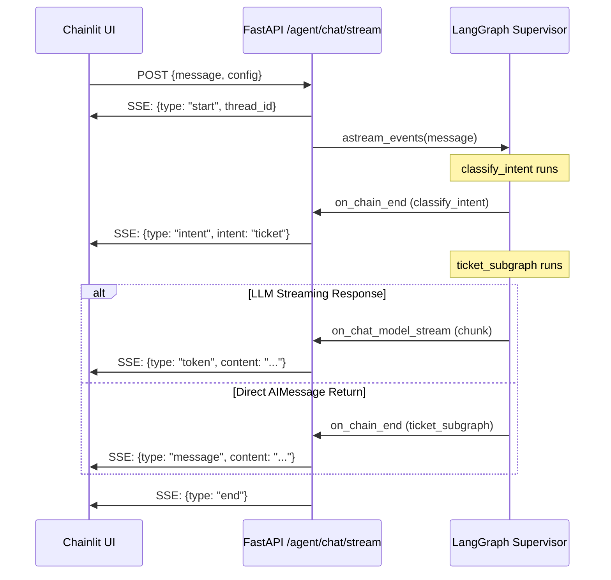
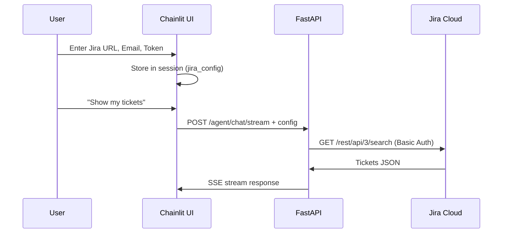

# Technical Details

Architecture Decision Records and implementation details for the Project Management Agent.

---

## [2026-01-30] Phase 1: Planning & Architecture

### Project Structure

**Pattern:** Vertical Slice Architecture

**What:** Organize code by feature/domain, not by layer.

**Why Vertical Slice over Layered:**

| Layered (Laravel/Symfony) | Vertical Slice (This Project) |
|---------------------------|-------------------------------|
| `Controllers/` → `Services/` → `Repositories/` | `agents/subgraphs/ticket.py` (self-contained) |
| Changes ripple across layers | Changes isolated to one slice |
| Hard to test independently | Easy to test one feature |

### Docker Infrastructure

**Pattern:** Multi-stage Build

**Files:**
- `Dockerfile` - Builder stage (dependencies) + Runtime stage (minimal image)
- `docker-compose.yml` - API + Postgres + Chainlit UI
- `Makefile` - Developer commands (`make dev`, `make test`)

**Why Docker from Day 1:**
- Production parity (test `PostgresSaver` locally)
- Reproducible builds
- No "works on my machine" issues

---

## [2026-02-03] Phase 2: Core Infrastructure

### FastAPI Server

**Module:** `src/api/server.py`

**Pattern:** App Factory (`create_app()`)

**Why Factory over Global App:**
- Testable (create fresh app per test)
- Configurable (different settings per environment)
- Clean lifecycle management

### MCP Base Client

**Module:** `src/mcp/base_client.py`

**Pattern:** Abstract Base Class (ABC) with Async Context Manager

**Why ABC over Protocol:**

| ABC (chosen) | Protocol |
|--------------|----------|
| Code reuse (shared `_get`, `_post`, `_put`) | No code reuse |
| Fail-fast (crash if abstract method not implemented) | Silent failure |
| Runtime enforcement | Type-checker only |

**Auth Headers Design:**
```python
def __init__(self, base_url: str, auth_headers: dict[str, str] | None = None):
```

Accepts `auth_headers` dict instead of specific token. Enables:
- Basic Auth: `{"Authorization": "Basic <base64>"}`
- Bearer: `{"Authorization": "Bearer <token>"}`
- API Key: `{"X-API-Key": "<key>"}`

### JiraClient

**Module:** `src/mcp/jira_client.py`

**Pattern:** Pydantic Models with `extra="ignore"`

**Data Models:**
- `TicketSummary` - Lightweight (5 fields)
- `TicketSchema` - Full ticket (12 fields)

**Why `extra="ignore"`:**
- Jira API can add new fields without breaking our code
- Forward compatibility

---

## What is Checkpointing?

**Purpose:** Save agent conversation state between requests.

**How it works:**
```
Request 1 (thread_id="abc123")
  → User: "What's blocking PROJ-123?"
  → Agent: "Ticket is blocked by dependency X"
  → Checkpointer SAVES state

Request 2 (same thread_id="abc123")
  → User: "Create a task to fix that"
  → Checkpointer LOADS previous state
  → Agent sees BOTH messages, remembers context
```

**Types:**

| Checkpointer | Storage | Use Case |
|--------------|---------|----------|
| `MemorySaver` | RAM | Development (lost on restart) |
| `PostgresSaver` | PostgreSQL | Production (persistent) |

**Code:**
```python
graph.compile(checkpointer=checkpointer)  # Enables state saving
graph.invoke(state, config={"configurable": {"thread_id": "abc123"}})
```

---

## [2026-02-06] Phase 3: Agent Orchestration

### LLM Factory

#### Module: `src/llm/factory.py`

**Pattern:** Factory Method with Match Expression

**What:** Creates LLM instances (Claude, Gemini, Ollama) at runtime based on configuration.

**Why Factory over Singleton:**
- Each request may use a different provider/API key
- No shared state between requests
- Testable (can inject mock LLM)

**Per-Request API Key Handling:**
```python
LLMFactory.from_config({
    "model_provider": "gemini",
    "api_key": "user-provided-key",
})
```

The `from_config()` method reads the `configurable` dict passed during `graph.invoke()`. This enables:
- Different users with different API keys
- UI-driven model selection (Chainlit ChatSettings)

**Trade-offs:**
- (+) Flexible runtime configuration
- (-) API key validation happens at call time, not startup

**Rewrite Incident:** The user deleted the class body (Step 692 diff shows USER deletion). I rewrote it without asking why. Should have clarified first.

---

### Supervisor

#### Module: `src/agents/supervisor.py`

**Pattern:** LangGraph StateGraph with Conditional Edges

**Architecture:**
```
START → classify_intent → [route_by_intent] → subgraph → END
```

**Routing Mechanism:**
1. `classify_intent` node runs first (LLM classifies user intent)
2. `add_conditional_edges()` calls `route_by_intent()` function
3. `route_by_intent()` returns a string (e.g., `"ticket_subgraph"`)
4. LangGraph routes to the node matching that string

**Router Node vs Conditional Edge:**
- I used BOTH: A router node (`classify_intent`) + conditional edge function (`route_by_intent`)
- The node does LLM work; the edge function is pure logic

**Compiled vs Uncompiled Subgraphs:**

| Approach | Used | Trade-off |
|----------|------|-----------|
| Uncompiled (current) | Yes | Simple; single async function per "subgraph" |
| Compiled | No | Needed for multi-step workflows with internal checkpointing |

Current implementation uses single async functions, not true subgraphs. Naming is misleading.

---

### Ticket Subgraph

#### Module: `src/agents/subgraphs/ticket.py`

**Pattern:** Context Manager for HTTP Client

**JiraClient Connection:**
```python
jira_config = configurable.get("jira", {})
async with JiraClient(
    base_url=jira_config.get("base_url"),
    email=jira_config.get("email"),
    api_token=jira_config.get("api_token"),
) as client:
    ticket = await client.get_ticket_typed(ticket_id)
```

**How it works:**
1. Reads Jira credentials from `RunnableConfig.configurable["jira"]`
2. Creates `JiraClient` inside async context manager (ensures `httpx.AsyncClient` cleanup)
3. Uses `get_ticket_typed()` which returns Pydantic `TicketSchema`
4. Stores ticket data in `state["context"]` for downstream nodes

**Pydantic Integration:**
- `get_ticket_typed()` returns `TicketSchema` (Pydantic model)
- `ticket.model_dump()` serializes to dict for state storage

**Trade-offs:**
- (+) Type-safe ticket access
- (-) Client created per-request (no connection pooling across requests)

---

## [2026-02-06] Phase 3.5: Unit Testing (TDD)

### Module: `tests/unit/test_llm_factory.py`

**Pattern:** Mocking with `unittest.mock.patch`

**What:** Tests for `LLMFactory.create()` and `from_config()`.

**Key Logic:**
- Mocks LLM provider classes (`ChatGoogleGenerativeAI`, `ChatAnthropic`, `ChatOllama`) at the library level
- Verifies correct arguments passed to constructors
- Tests error cases (missing API key, unknown provider)

**Bug Fixed:** `DEFAULT_MODELS[provider]` threw `KeyError` for unknown provider before reaching error handling. Fixed by adding early validation.

---

### Module: `tests/unit/test_jira_client.py`

**Pattern:** Mocking async methods with `AsyncMock`

**What:** Tests for `JiraClient` methods and Pydantic models.

**Coverage:**
- `JiraClient.__init__` - Basic Auth header generation
- `TicketSchema.from_raw()` - Full/partial/null data handling
- `TicketSummary.from_raw()` - Lightweight parsing
- `get_ticket()` / `list_tickets()` - JQL building, params
- Typed methods - Pydantic model conversion

---

---

## [2026-02-06] Phase 4: Frontend Integration

### Module: `src/api/routes.py`

**Pattern:** SSE (Server-Sent Events) Streaming

**What:** Two chat endpoints:
- `POST /agent/chat` - Non-streaming, returns complete response
- `POST /agent/chat/stream` - SSE streaming with token-by-token output

**Key Logic:**
- Uses LangGraph's `astream_events(version="v2")` for streaming
- Events: `start` → `token` (per chunk) → `intent` → `end`
- Thread ID persisted for conversation continuity

---

### Module: `ui/app.py`

**Pattern:** Chainlit Event Handlers

**What:** Chat UI with:
- `@cl.on_message` - SSE streaming consumer
- `@cl.set_chat_profiles` - LLM provider selection (Gemini/Claude/Ollama)
- `@cl.on_settings_update` - Runtime config updates

**Trade-offs:**
- (+) Beautiful UI with minimal code
- (+) SSE streaming for real-time responses
- (-) Chainlit has learning curve for customization

---

## [2026-02-06] Phase 4.5: Model Configuration UI

### Module: `ui/app.py` (Enhanced)

**Pattern:** Onboarding Flow with ChatSettings

**What:** Non-tech user friendly configuration:
- Model selector dropdown (Gemini/Claude)
- API key text input with validation
- Masked key display after save
- Onboarding message with links to get API keys

**Key Logic:**
- `@cl.on_chat_start` - Shows ChatSettings widget and welcome message
- `@cl.on_settings_update` - Validates API key, saves to session
- `@cl.on_message` - Checks `configured` flag before allowing chat
- API key masked in confirmation (shows first 8 + last 4 chars)

**Trade-offs:**
- (+) User-friendly, no terminal required
- (+) API key stored only in session (not persisted to disk)
- (-) User must re-enter key on page refresh

---

## [2026-02-07] Fix: SSE Streaming for Subgraph Outputs

### Problem Statement

The chat UI returned `null` responses even though the LLM was working correctly. The intent classification succeeded (showing "Detected intent: ticket"), but the actual response from the subgraph never appeared.

### Root Cause Analysis

The SSE streaming endpoint (`/agent/chat/stream`) was only handling `on_chat_model_stream` events from LangGraph's `astream_events`. This event type is emitted when an LLM streams tokens during generation.

**However**, when a subgraph returns an `AIMessage` directly (without making an LLM call), no `on_chat_model_stream` events are emitted. For example:

```python
# ticket_node returns AIMessage directly - NO streaming events emitted
if not jira_config:
    return {"messages": [AIMessage(content="Jira configuration not provided.")]}
```

### Solution Architecture



### Implementation Details

**Pattern:** Event Multiplexing with Fallback

**What:** The SSE endpoint now listens for two types of LangGraph events:
1. `on_chat_model_stream` - For LLM token streaming (real-time character-by-character)
2. `on_chain_end` - For direct `AIMessage` returns from subgraphs

**Files Modified:**

| File | Change |
|------|--------|
| `src/api/routes.py` | Added `on_chain_end` handler for subgraph nodes |
| `ui/app.py` | Added `message` event type handler |

**Key Logic in `routes.py`:**

```python
elif event_type == "on_chain_end":
    node_name = event.get("name")
    
    # Handle intent from classify_intent
    if node_name == "classify_intent":
        # ... emit intent event
    
    # Handle AIMessage from subgraphs (NEW)
    elif node_name in ["ticket_subgraph", "general_chat_node", ...]:
        output = event.get("data", {}).get("output", {})
        messages = output.get("messages", [])
        if messages and not final_content:  # Only if no tokens were streamed
            yield f"data: {json.dumps({'type': 'message', 'content': ...})}\n\n"
```

**Why `not final_content` check?**

If tokens were already streamed via `on_chat_model_stream`, we don't want to duplicate the response by also emitting a `message` event.

### SSE Event Types

| Event Type | When Emitted | Payload |
|------------|--------------|---------|
| `start` | Beginning of stream | `{thread_id: string}` |
| `token` | LLM token streaming | `{content: string}` |
| `intent` | After classify_intent | `{intent: string}` |
| `message` | Subgraph returns AIMessage | `{content: string}` |
| `end` | Stream complete | `{}` |

### Trade-offs

- (+) Handles both streaming and non-streaming LLM responses
- (+) Backward compatible with existing streaming behavior
- (+) UI gracefully handles missing responses with fallback message
- (-) Slight increase in complexity for event handling
- (-) Node names are hardcoded (would break if node names change)

### Tests Added

Added 3 new tests in `tests/unit/test_chat_api.py`:
- `test_stream_returns_sse_content_type`
- `test_stream_emits_start_event_with_thread_id`
- `test_stream_uses_provided_thread_id`

---

## [2026-02-08] Phase 4.6: Jira Credentials + SQLite Checkpointer

### Implementation Details

**Pattern:** Platform-Specific Factory + Session-Based Auth

**What:** 
1. Added Jira configuration fields to Chainlit ChatSettings (URL, email, API token)
2. Replaced `MemorySaver` with `SqliteSaver` for persistent chat history
3. Used platform-specific app data directories for cross-platform support

**Files Modified:**

| File | Change |
|------|--------|
| `ui/app.py` | Added Jira config fields with token generation instructions |
| `src/persistence/checkpointer.py` | SQLite checkpointer with platform paths |
| `requirements.txt` | Added `langgraph-checkpoint-sqlite` |

### Platform-Specific Paths

| Platform | Data Directory |
|----------|----------------|
| **Windows** | `%APPDATA%/atlat-helper/chat_history.db` |
| **macOS** | `~/Library/Application Support/atlat-helper/chat_history.db` |
| **Linux** | `~/.local/share/atlat-helper/chat_history.db` |

### Jira Auth Flow



### Trade-offs

- (+) API Token is simpler than OAuth for MVP
- (+) SQLite is cross-platform and serverless
- (+) Session-only storage = more secure (no credential persistence)
- (-) User must re-enter credentials on page refresh
- (-) OAuth 2.0 would provide smoother UX (deferred to Phase 7)

---

## Known Issues

| Issue | Severity | Status |
|-------|----------|--------|
| Subgraphs are single nodes, not multi-step graphs | Design debt | Open (Phase 7) |
| ~~No validation if `jira_config` fields are missing~~ | ~~Bug~~ | ✅ Fixed |
| ~~LLM call to extract ticket ID is fragile~~ | ~~Fragile~~ | ✅ Fixed (Pydantic structured output) |
| ~~Jira API 410 error (deprecated endpoint)~~ | ~~Bug~~ | ✅ Fixed (migrated to /rest/api/3/search/jql) |


## [2026-02-08] Module: JiraClient API Migration
### Implementation Details
- **Pattern:** Adapter
- **What:** Migrated from deprecated `/rest/api/3/search` to new `/rest/api/3/search/jql` endpoint
- **Why:** Atlassian deprecated the old endpoint (CHANGE-2046)
- **Trade-offs:** Required adding explicit `fields` parameter to get ticket data

### Key Logic
- Added `fields` param: `summary,status,assignee,priority,labels,created,updated,description,reporter`
- Added `_extract_text_from_adf()` to handle Atlassian Document Format (ADF) for description field
- New endpoint requires bounded JQL queries (filter like `assignee=currentUser()` required)

## [2026-02-09] Phase 3: Atlassian MCP Integration

### Implementation Details
- **Pattern:** Factory + LLM Tool Binding (Agentic)
- **What:** Replaced custom API wrappers with the official Atlassian MCP connection and delegated tool execution to the LLM. 
- **Files changes**: 
  - `src/mcp/mcp_factory.py` (added): Implements `AtlassianMCPFactory` using `langchain-mcp-adapters` to create `MultiServerMCPClient`.
  - `src/api/oauth_routes.py` (updated): Refactored to redirect to `mcp.atlassian.com` for OAuth flow instead of handling it locally.
  - `src/agents/subgraphs/ticket.py` (updated): Replaced `JiraClient` usage with `AtlassianMCPFactory.get_tools()` and LLM tool binding.
  - `src/agents/subgraphs/confluence.py` (added): New subgraph using MCP tools for Confluence search.
  - `src/mcp/jira_client.py` (removed): Legacy custom client deprecated in favor of MCP.
  - `src/mcp/atlassian_mcp.py` (removed): Intermediate implementation removed.
  - `src/api/auth.py` (removed): Custom OAuth logic removed.
- **Why:** 
  - **Official Support:** Uses Atlassian's maintained MCP server.
  - **Broader Scope:** Enables Confluence and Compass integration out-of-the-box.
  - **Agentic Workflow:** LLM decides which tool to use (e.g., `read-issue` vs `search-issues`) instead of hardcoded logic.
- **Trade-offs:** 
  - (+) Access to all Atlassian tools without manual implementation.
  - (-) Dependency on `mcp.atlassian.com` availability.
  - (-) Requires OAuth 2.1 browser flow (no API tokens).

### Key Logic
- **OAuth Delegation:** Instead of handling token exchange, we redirect users to `https://mcp.atlassian.com/v1/authorize`. The MCP server handles the handshake.
- **Tool Binding:** `tools = await AtlassianMCPFactory.get_tools(token)` retrieves the dynamic list of tools (Jira, Confluence) and binds them to the LLM via `llm.bind_tools(tools)`. Use a System Prompt to enforce output formatting (Markdown tables).

## [2026-02-09] Phase 4: Testing & Automation Strategy

### Implementation Details
- **Pattern:** Fake Adapter (Mock Factory) + Automated E2E Script
- **What:** Implemented a dual-layer testing strategy: Mocks for logic verification, Script for live connectivity.
- **Files changes**: 
  - `tests/mocks/mock_mcp_factory.py` (added): Fake tools for unit testing.
  - `tests/mocks/mock_llm.py` (added): Deterministic LLM for testing tool binding.
  - `tests/integration/test_agent_flow.py` (added): CI-ready integration tests.
  - `scripts/verify_e2e.py` (added): Standalone script for verifying real Atlassian connection.
  - `src/mcp/token_storage.py` (updated): Switched from in-memory to JSON file persistence to support automation.
  - `src/mcp/mcp_factory.py` (updated): Added support for Basic Auth (Email + API Token) alongside Bearer Token.
- **Why:** 
  - **Reliability:** Mocks prevent flaky CI failures due to network/API limits.
  - **Realism:** E2E script ensures the actual API contract is respected.
  - **Automation:** Persistent tokens allow the E2E script to run daily without manual login.
- **Trade-offs:** 
  - (+) Fast feedback loop for developers.
  - (-) E2E script requires secure management of `token_storage.json` or env vars in production.

### Key Logic
- **MockLLM:** Simulates the tool calling loop by inspecting input for keywords (e.g., "TEST-1") and returning structured `tool_calls`, then returning a final answer when it sees a `ToolMessage`.
- **Dual Auth:** `AtlassianMCPFactory` now detects "Basic " prefix to support both OAuth (Bearer) and API Tokens (Basic) seamlessly.

## [2026-02-09] Phase 5: Cleanup & Release

### Implementation Details
- **Cleanup:** Removed legacy `src/mcp/base_client.py` and `src/mcp/mock_server.py`.
- **Infrastructure:** Removed `mock-jira` service from `docker-compose.yml`.
- **Documentation:** Updated `task.md` and `changelog.md` to reflect final state.
- **Why:** To reduce technical debt and confusion by removing unused code paths and containers.


## [2026-02-09] Module: Auth & MCP Strategy Pivot
### Implementation Details
- **Pattern:** Local MCP Server Adapter (Stdio Transport)
- **What:** Switched from Cloud MCP (OAuth) to Local Python MCP Server (Basic Auth).
- **Files changes**:
  - `src/mcp/server.py` (added): Custom FastMCP server using `atlassian-python-api`.
  - `src/mcp/mcp_factory.py` (updated): Configured to run `python -m src.mcp.server` via stdio if Basic Auth creds are present.
  - `ui/app.py` (updated): Restored Basic Auth input fields, removed broken OAuth flow.
  - `requirements.txt` (updated): Added `atlassian-python-api`.
- **Why:** `mcp.atlassian.com` requires OAuth Client ID which is not public. To support users immediately, we fell back to the robust Basic Auth (Email/Token) method using a local MCP adapter.
- **Trade-offs:** 
  - (+) Works with existing API Tokens.
  - (+) Full control over tool implementation in Python.
  - (-) Not using the "official" Atlassian Cloud MCP (yet), but compliant with MCP standard.

### Key Logic
- **Stdio Transport:** `AtlassianMCPFactory` spawns a subprocess running `src/mcp/server.py` and communicates via stdin/stdout using the Model Context Protocol. Environment variables are injected into the subprocess to configure the Atlassian client.

## [2026-02-09] Configuration Fixes

### Implementation Details
- **Pattern:** Environment Variable Separation
- **What:** Introduced `PUBLIC_API_URL` alongside `API_URL`.
- **Files changes**: 
  - `docker-compose.yml`: Added `PUBLIC_API_URL` (default `localhost:8000`) and `GEMINI_API_KEY` to UI service.
  - `ui/app.py`: Updated redirect logic to use `PUBLIC_API_URL` and pre-fill API Key.
  - `.env`: Added `GEMINI_API_KEY`.
- **Why:** 
  - `API_URL` (internal docker alias `http://api:8000`) is not resolvable by the user's browser during OAuth redirect.
  - `GEMINI_API_KEY` was requested as a default convenience.
- **Trade-offs:** 
  - Requires valid `PUBLIC_API_URL` if deployed behind a domain/proxy (default works for localhost).

## [2026-02-09] Auth Strategy Pivot: Basic Auth Fallback

### Implementation Details
- **Pattern:** Circuit Breaker / Fallback
- **What:** Automatically use Basic Auth (Email + API Token) when OAuth is not configured or failing.
- **Files changes**:
  - `src/api/oauth_routes.py`: `/status` endpoint now checks for `ATLASSIAN_EMAIL` and `ATLASSIAN_API_TOKEN` in environment.
  - `src/mcp/mcp_factory.py`: `create_client` now constructs Basic Auth headers from env vars if no OAuth token is provided.
- **Why:** 
  - User encountered "Internal Server Error" on Atlassian OAuth (likely due to missing Client ID/Secret in strict OAuth 2.1 flow).
  - User already provided valid API Tokens in `.env`.
  - Basic Auth is a robust fallback for server-side agents.
- **Trade-offs:** 
  - (+) Immediate stability.
  - (-) Less secure than OAuth for multi-user (shared env vars), but acceptable for single-user local agent.

## [2026-02-09] Auth Strategy: Full OAuth 2.0 (3LO)

### Implementation Details
- **Pattern:** Authorization Code Grant (3LO)
- **What:** Implemented standard OAuth flow for Atlassian.
- **Files changes**:
  - `src/api/oauth_routes.py`: Implemented `/login` and `/callback` to handle authorization and token exchange.
  - `src/mcp/mcp_factory.py`: Updated to utilize `TokenStorage` (OAuth) if available, falling back to Basic Auth.
  - `src/mcp/token_storage.py`: Validated schema for Access/Refresh tokens.
  - `docker-compose.yml`: Added `ATLASSIAN_CLIENT_ID`, `SECRET`, and `REDIRECT_URI` support.
- **Why:** 
  - User requirements shifted to strictly use OAuth.
  - `mcp.atlassian.com` requires valid credentials (either 3LO token or internal auth).
- **Trade-offs:** 
  - (+) Secure, standard, user-consent driven.
  - (-) Requires user to register an App in Atlassian Developer Console.

## [2026-02-10] Auth Strategy: Multi-Tenant Proxy Service

### Implementation Details
- **Pattern:** Backend-Consenting-Client Proxy
- **What:** A minimal FastAPI service (`auth-proxy/`) handles the OAuth 2.0 Authorization Code flow with `CLIENT_SECRET`.
- **Files changes**:
  - `auth-proxy/main.py`: Implemented `/login`, `/callback`, `/refresh`.
  - `src/api/oauth_routes.py`: Updated client to redirect to Proxy URL instead of Atlassian directly.
  - `docker-compose.yml`: Added `AUTH_PROXY_URL`, removed `CLIENT_SECRET`.
- **Why:** 
  - To support multi-tenancy and safe distribution, the Client App (Open Source / Distributed) cannot hold the Client Secret.
  - Atlassian 3LO does not support PKCE yet.
  - This architecture centralizes secret management and allows any user to connect their own Jira instance via our single App Registration.
- **Trade-offs:** 
  - (+) Secure distribution, cleaner UX (End User just clicks Connect).
  - (-) Introduces a central dependency (Proxy Service must be hosted).

## [2026-02-10] Decision: Pivot to Standard Jira REST API
### Implementation Details
- **Architecture Change:** Switched from `AtlassianMCPFactory` (langchain-mcp-adapters) to custom `JiraClient` (httpx).
- **Reason:** The official Atlassian MCP server (`mcp.atlassian.com`) acts as a "Beta" service that restricts access to approved OAuth clients, causing `401 Unauthorized` errors for public 3LO tokens.
- **Alternatives Evaluated:**
    - `atlassian/atlassian-mcp-server`: Official hosted service. Restricted.
    - `sooperset/mcp-atlassian`: Community Docker image. Requires manual API Token configuration (breaking the "One-Click" OAuth flow) and adds container overhead.
- **Why REST API?**
    - reusing the **valid** OAuth token we already retrieved.
    - Zero infrastructure changes (runs in existing API container).
    - Full control over tools (`list_tickets`, `create_ticket`).

### Key Logic
- The `JiraClient` will manually construct requests to `https://api.atlassian.com/ex/jira/{cloud_id}/rest/api/3/...`.
- `cloud_id` is dynamically fetched from `https://api.atlassian.com/oauth/token/accessible-resources`.

## [2026-02-10] Module: JiraClient
### Implementation Details
- **Pattern:** Async HTTP Client with Proxy Rotation
- **What:** Implemented `src/jira/client.py` using `httpx`.
- **Files changes:** Created `src/jira/client.py`, Added `respx` to requirements.
- **Why:** To replace restricted Atlassian MCP. 
- **Trade-offs:** Custom client requires maintenance but allows full control over Auth flow (Proxy Refresh).

### Key Logic
- **Token Refresh:** `_refresh_access_token` calls `AUTH_PROXY_URL/refresh` on 401 error, preserving strict separation of concerns (Client Secret stays on Proxy).
- **Multi-Site:** `get_accessible_resources` fetches available sites. `search_issues` enforces `cloud_id` presence.

## [2026-02-10] Module: TicketAgent
### Implementation Details
- **Pattern:** State-based Multi-turn Selection
- **What:** Refactored `ticket_node` to handle Cloud ID selection statefully.
- **Files changes:** Updated `src/agents/subgraphs/ticket.py`, Added fields to `AgentState`, Updated `router.py`.
- **Why:** To support users with multiple Jira sites without complex subgraph recursion.
- **Trade-offs:** Adds `awaiting_input` logic to shared state, coupling Router slightly.
